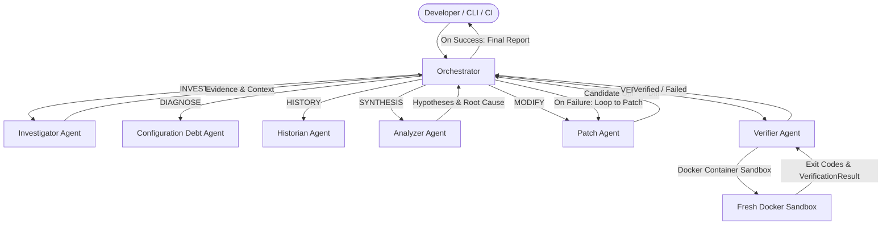

# ARGUS

> **An MCP-Native Framework for Reliable Agentic Software Engineering**

ARGUS is an open-source research and engineering platform designed to enable autonomous AI agents to investigate, diagnose, modify, and verify software repositories using the Model Context Protocol (MCP), Groq LLMs (`llama-3.3-70b-versatile`, `llama-3.1-8b-instant`), and isolated Docker container verification sandboxes.

---

## 🏛 Core Architecture & Agent Pipeline

ARGUS strictly decomposes complex software engineering tasks into specialized, single-responsibility agents orchestrated via typed runtime contracts (`AgentEnvelope`, `RunState`, `Finding`, `Evidence`):



### Specialized Agents

- **Investigator Agent** (`agents/investigator`): Explores repositories, reads files, inspects git trees, and gathers grounded evidence.
- **Analyzer Agent** (`agents/analyzer`): Correlates static analysis findings and CI errors to formulate concrete hypotheses (`FACT` vs `INFERENCE` vs `HYPOTHESIS`).
- **Configuration Agent** (`agents/configuration`): Analyzes configuration debt across GitHub Actions and Dockerfiles using 10 deterministic rules.
- **Historian Agent** (`agents/historian`): Inspects repository git history, blames, and commit intent.
- **Patch Agent** (`agents/patch`): Generates candidate unified diff code modifications.
- **Verifier Agent** (`agents/verifier`): Executes multi-stage isolated verification (AST, lint, vitest) inside fresh Docker sandboxes.
- **Orchestrator** (`packages/orchestrator`): Central state machine managing transitions, budget enforcement, and execution trajectories.

---

## 🚀 Getting Started

### 1. Prerequisites

- **Node.js**: `>= 20.0.0`
- **pnpm**: `>= 9.0.0`
- **Docker Desktop**: (For sandboxed verification)
- **Groq API Key**: (Free tier at [console.groq.com](https://console.groq.com/keys))

### 2. Environment Configuration

Create a `.env.local` file in the root directory (or export environment variables in your shell):

```bash
# In .env.local (git-ignored)
GROQ_API_KEY=gsk_your_groq_api_key_here
GITHUB_TOKEN=github_pat_your_token_here
```

### 3. Installation & Build

```bash
# Install dependencies across all 21 monorepo packages
pnpm install

# Build the entire monorepo
pnpm build

# Run all unit tests
pnpm test

# Run end-to-end multi-agent pipeline test
pnpm test:e2e
```

---

## 💻 CLI Usage

ARGUS provides a developer CLI for local scanning, patch verification, and multi-agent problem resolution:

### 1. Configuration Debt Scanning

Scan GitHub Actions workflows and Dockerfiles for 10 deterministic anti-patterns:

```bash
pnpm argus config scan .
```

### 2. Isolated Docker Patch Verification

Verify a unified diff inside a fresh, isolated Docker container (`node:20-alpine`):

```bash
pnpm argus verify path/to/fix.diff --sandbox
```

### 3. Multi-Agent Analysis Run

Launch the autonomous agent orchestration loop on a local or remote repository:

```bash
# Analyze local repository
pnpm argus analyze

# Analyze specific target PR with custom objective
pnpm argus analyze --repo owner/repo --pr 42 --objective "Fix failing CI integration tests"
```

---

## 📁 Repository Structure

```text
argus/
├── apps/
│   ├── cli/            # Developer CLI (argus analyze, verify, config scan)
│   ├── dashboard/      # Web-based observability dashboard
│   └── github-action/  # ARGUS GitHub Action entrypoint
├── packages/
│   ├── agent-core/     # Canonical schemas (Zod), AgentEnvelope, contracts
│   ├── orchestrator/   # Central coordination state machine & loop
│   ├── shared/         # Groq LLM client, prompt builder, MCP adapter
│   ├── sandbox/        # Isolated Docker container lifecycle & exec
│   ├── verifier/       # Multi-stage verification pipeline runner
│   ├── mcp-server/     # MCP server runtime & protocol handlers
│   ├── git/            # Git inspection & repository MCP tools
│   ├── github/         # GitHub API client, PR, and CI tools
│   ├── config-engine/  # Deterministic configuration debt rule engine
│   └── trajectory/     # Structured event logging and audit trails
├── agents/             # Role-specialized agents (Investigator, Analyzer, etc.)
├── rules/              # 10 deterministic debt rules (CD001-CD005, CD101-CD105)
├── benchmarks/         # 10 comparative benchmark dataset cases & Baseline A/B runners
└── tests/              # End-to-end full pipeline integration tests
```

---

## 📊 Comparative Benchmarks

ARGUS includes built-in comparative evaluation against standard single-agent and toolless LLM baselines (§26-§31):

- **Baseline A**: Direct LLM reasoning on issue descriptions without tool access.
- **Baseline B**: Single-agent LLM reasoning with static file context.
- **ARGUS MCP**: Multi-agent orchestrated pipeline with dynamic MCP tool usage and deterministic verification.

Run benchmark evaluation:

```bash
pnpm test --filter @argus/benchmarks
```

---

## 📜 Development & Contribution Guidelines

Please consult [AGENTS.md](./AGENTS.md) and [CONTRIBUTING.md](./CONTRIBUTING.md) for full architecture standards, package ownership, runtime schema validation rules, and git hygiene policies.
